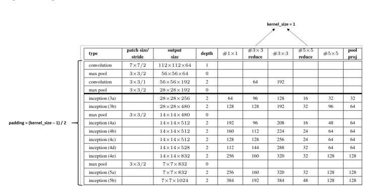
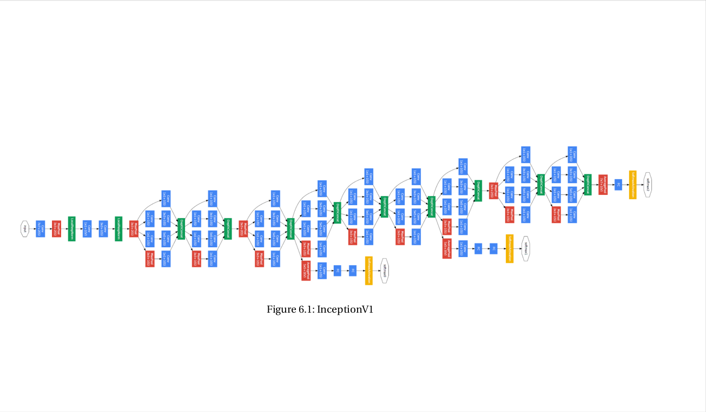
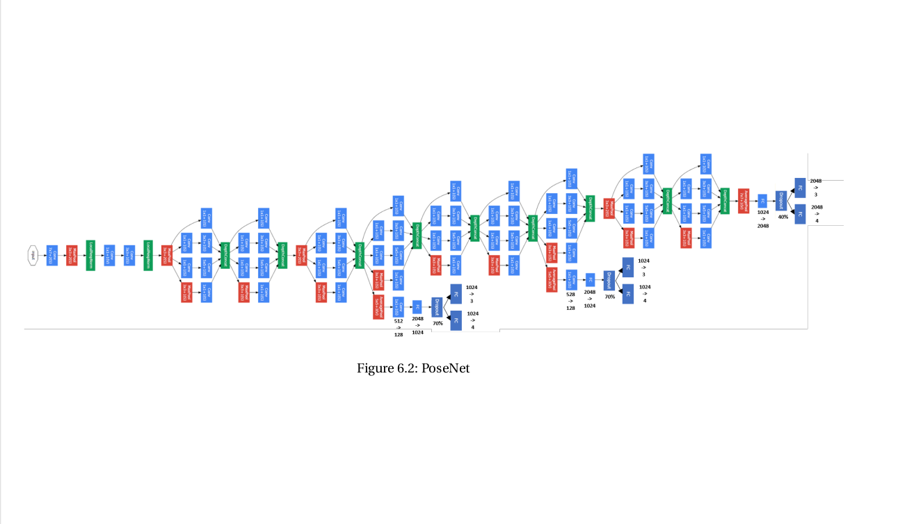
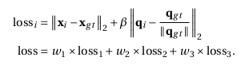
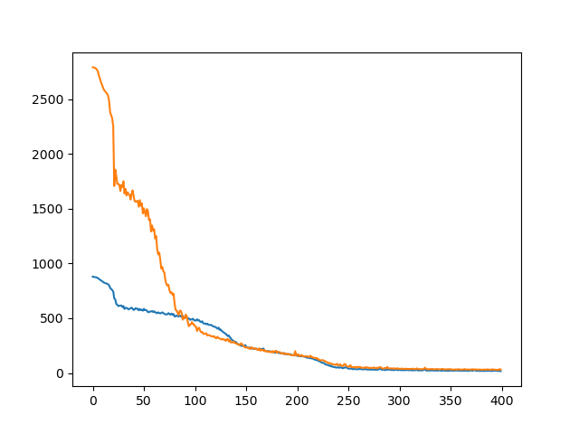

# Implementation of PoseNet
* [People](emoji.md#people) - (:blush:);

Download the KingsCollege dataset from here and extract it in the data/datasets/ in your root directory.
[KingsCollege](https://www.repository.cam.ac.uk/bitstream/handle/1810/251342/KingsCollege.zip)

Download the googlenet as pre-trained model from here and extract it in the ./pretrained_models/ directory.
[pre-trained model](https://vision.in.tum.de/webarchive/hazirbas/poselstm-pytorch/places-googlenet.pickle)

## PoseNet struture
change the struture different from original[1]
#### Implement the U-net architecture for cell image data segmentation using PyTorch.

1. Remove all three softmax layers with their preceding linear classifier layers. Replace
them with 2 parallel linear layers. One with an output size of 3 to predict the xyz po-
sition, and another one with an output size of 4 to predict the wpqr orientation. The
position is predicted as a 3D coordinate and the orientation as a Quaternion in wpqr
ordering.
2. In the final (third) loss header, insert another linear layer with output dimension 2048.
This output will then be used as the input for the two linear layers described in the
previous point.

#### loss function
The PoseNet architecture has three loss headers. Each of these loss headers predicts an xyz
position and a wpqr orientation. The position is predicted as a 3D coordinate and the orien-
tation as a Quaternion in wpqr ordering. We will calculate a loss for each loss header individ-
ually and then add them together to build the final loss. The loss is given by

#### data augmentation

#### Final Results:
1. Resize: Resize the images to make the smaller dimension equal to 256 (e.g. 1920x1080 to 455x256).
2. Subtract a mean image: To boost the training, a mean image I mean needs to be subtracted from each image. I mean needs to be precomputed. For this, finish generate_mean_image()
as follows:
• Load each image.
• Resize as in step 1.
• Add them together.
• Normalize values by the number of images.
The precomputed mean image I mean needs to be subtracted from each image when serving the images to the training/testing loop.(Hint: Subtracting images can easiest be done by converting them to numpy arrays. Note that numpy stores images as (height, width), while PIL stores images as (width, height).)
3. Crop: InceptionV1 is designed for a 224x224 input, so we need to crop the images to this size.
• During training: Crop a random 224x224 piece out of the image.
• During testing: Crop the 224x224 center out of the image.
4. Normalize: Use a mean of 0.5 and standard deviation of 0.5 to normalize each channel of the images.

**Left is label, right is the corresponding prediction.**

#### References
[1] A. Kendall, M. Grimes and R. Cipolla, "PoseNet: A Convolutional Network for Real-Time 6-DOF Camera Relocalization," 2015 IEEE International Conference on Computer Vision (ICCV), 2015, pp. 2938-2946, doi: 10.1109/ICCV.2015.336.
